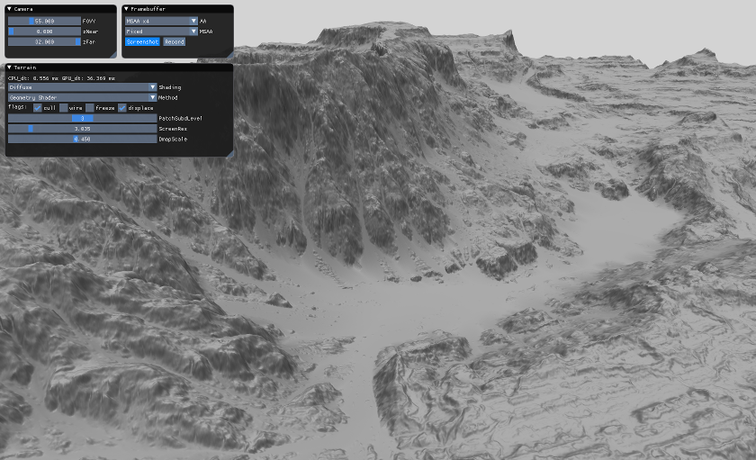

# Implicit Subdivision on the GPU

## License
This code is public domain.

## Details
This demo provides additional implementations for the article 
"Adaptive GPU Tessellation with Compute Shaders" by 
[Jad Khoury](https://github.com/jadkhoury), 
[Jonathan Dupuy](http://onrendering.com/) (myself) and 
[Christophe Riccio](https://github.com/g-truc); 
the paper is available on my website: <http://onrendering.com>.

Many thanks to [Cyril Crassin](https://twitter.com/Icare3D) (from NVIDIA) for 
helping me putting this demo up (the mesh shader pipeline exists thanks to 
his help). 

Specifically, the demo provides up to 4 rendering techniques:

* *Compute Shader* -- Similar to that of the original article; original demo available here: https://github.com/jadkhoury/TessellationDemo.

* *Tessellation Shader* -- Single-pass rendering with tessellation shaders; the tessellation shader produces a grid with *fixed* 
tessellation factors.

* *Geometry Shader* -- Single-pass rendering with a geometry shader; the geometry shader produces a grid with *fixed* 
tessellation factors.

* *Mesh Shader* -- Single-pass rendering with a task and mesh shader (Turing GPUs only); the mesh shader produces a grid 
with *fixed* tessellation factors. 

The demo loads a 16-bit displacement map and allows the user to play with the subdivision parameters.
This source code is released in order to facilitate adoption by developpers.

## Some Notes for Performance Comparisons
The user can interactively change the rendering pipeline at run-time and see how performance scales. Please do keep in mind however:  
* We did not extensively optimize the rendering pipelines: We believe that our algorithms can be made faster with careful optimization. This demo is meant to provide the algorithms to implement a fast terrain renderer, but we leave it up to the developper to make it run optimally on the platforms they target. 
* The tessellation shader pipeline produces more triangles than the other pipelines: Although all rendering pipelines target the same polygon per pixel density, the tessellation produced by the tessellation shader pipeline produces more triangles than the other pipelines. This is because GPU tessellation units have a fixed, hardware accelerated triangulation algorithm that differs from the one we use in the other rendering pipelines. This is something to keep in mind if rasterization becomes the bottleneck.

